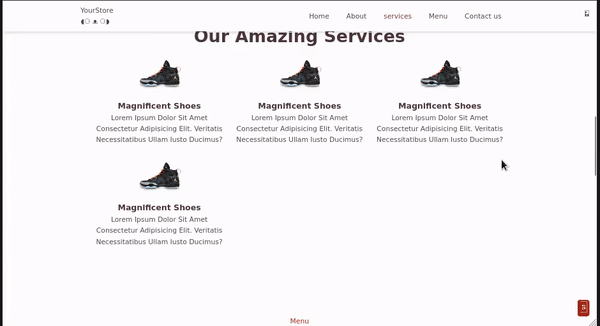

<div align="center">


[](https://github.com/DSDmark/Shoes-webTemplate/actions/workflows/jekyll-gh-pages.yml)


# HTML WEB TEMPLATES

<div>

---

<div align="center">

<div align="left">

## Purpose

> Do you want to build a professional website for your business or project? Do you have basic HTML knowledge? Then HTML website templates are the best option for you. An HTML template is the perfect solution if you want to save time and still have full control of your website.

---

### How to use

1. Click on green **Clone or download** button and choose Download ZIP.
2. Find the downloaded zipped file on your pc and extract it.
3. Go to **Web-Info** folder. Inside you will find a file named **index.html**.
4. Double click on **index.html** file and your browser will open (or maybe just a new tab) and the side will start.
5. If for whatever reason your browser does not open, right click on **index.html** file go down to **Open with** and choose your web browser. This will open the browser and launch the side.

---

### Clone the repository
1. Clone the repo using git cli. ```git clone https://github.com/DSDmark/Shoes-webTemplate.git```
2. Go to the folder ***Web-Info*** ```cd Web-Info```

---

## Try Out Shoes-webTemplate Demo

<a href="https://dsdmark.github.io/Shoes-webTemplate/" alt="Shoes-webTemplate Demo">Shoes-webTemplate Demo</a>

</div>

### Shoes-webTemplate



</div>

> If you have any issues with the game feel free to let me know!

---
